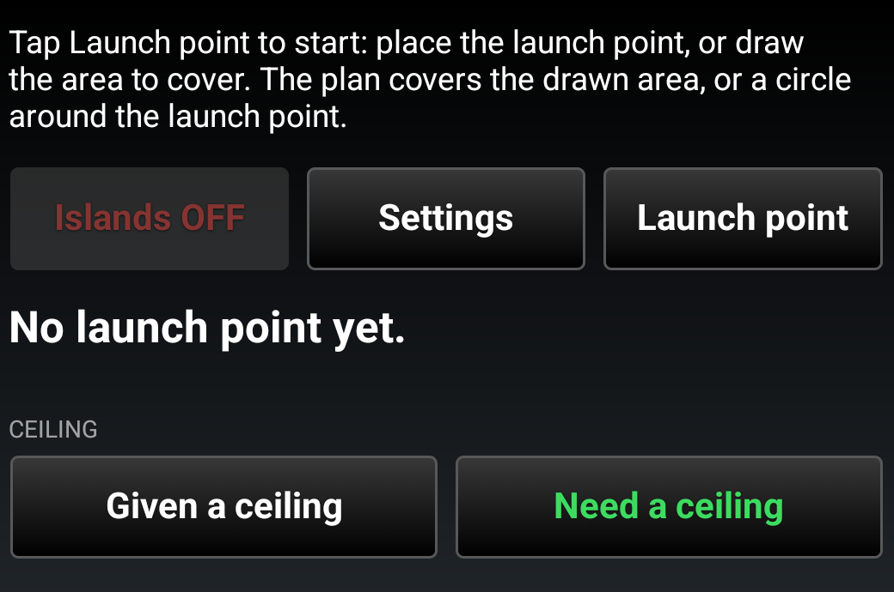
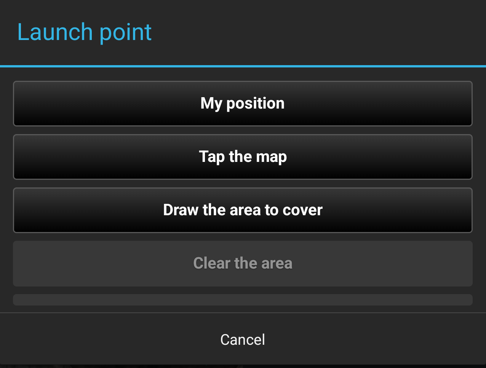
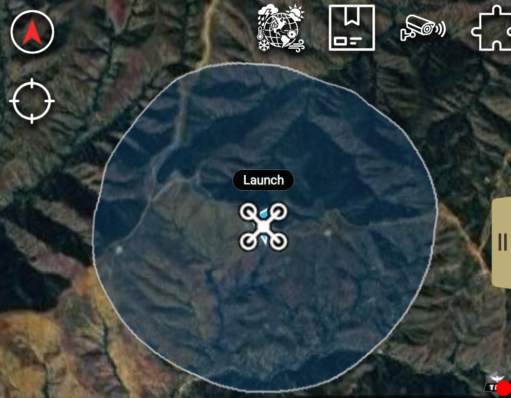
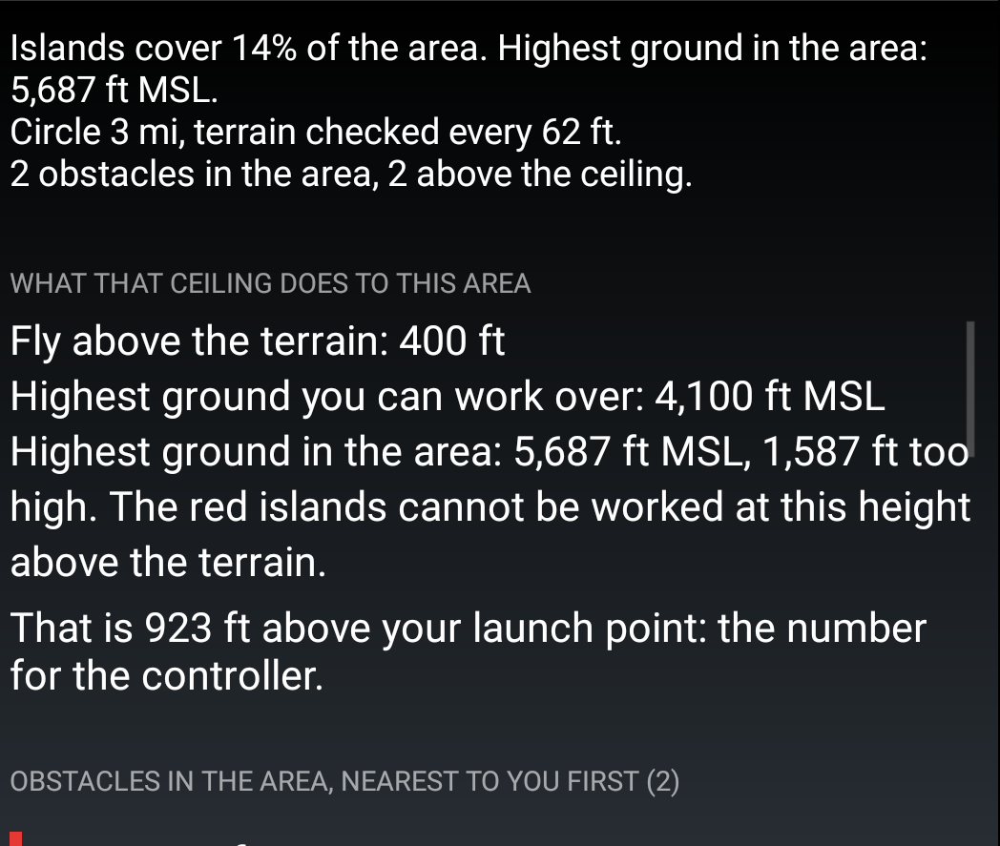
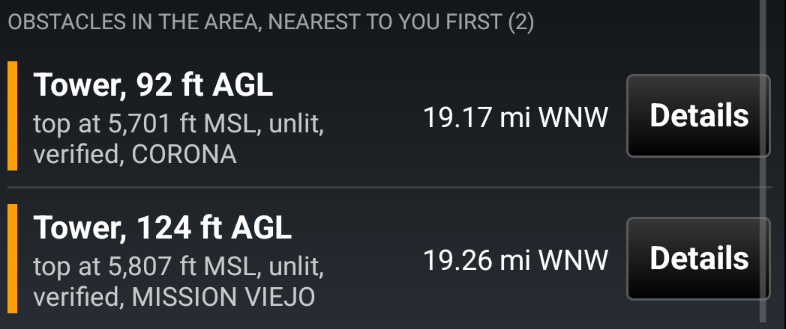
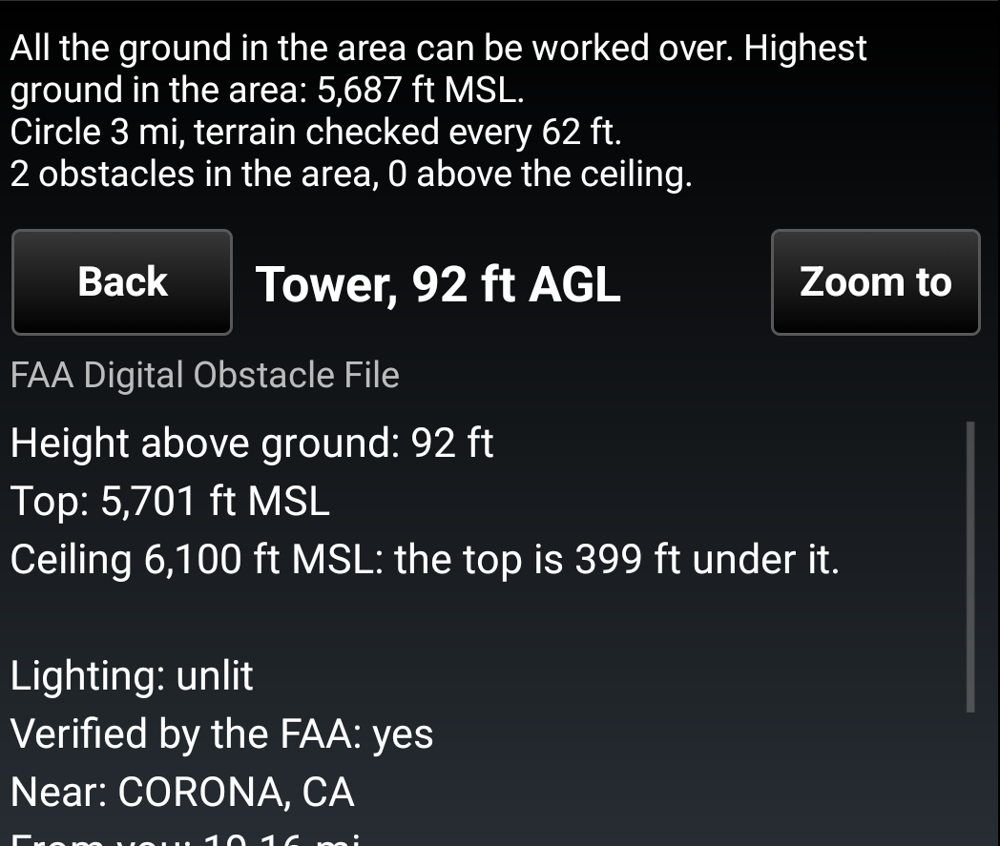
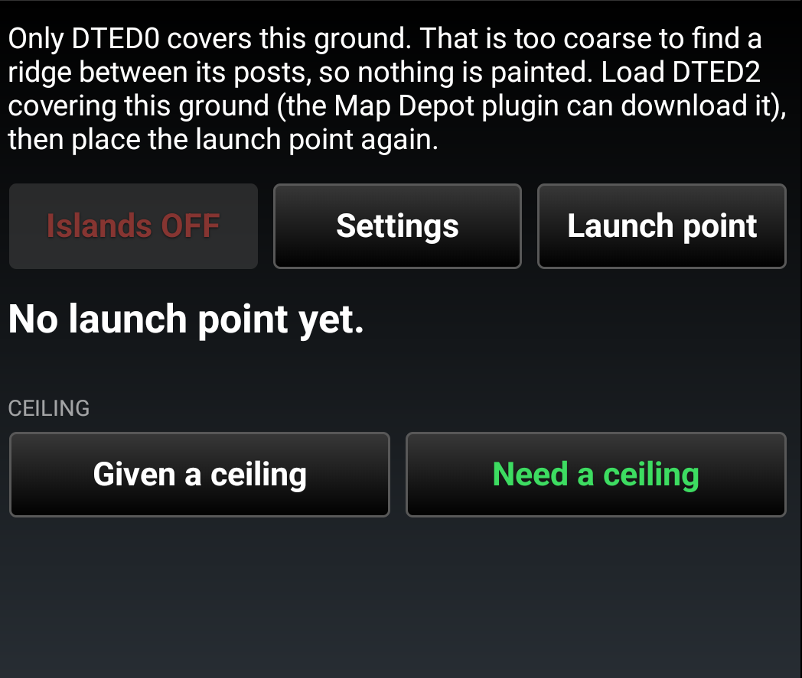

# UAS Flight Plan for ATAK — User Guide

**Version 0.1 · takwerx**

**Download UAS Flight Plan 0.1** (pick the one matching your ATAK-CIV version, sideload, then load it in ATAK's Plugins manager):

- **ATAK-CIV 5.8:** https://github.com/takwerx/uas-flight-plan/releases/download/v0.1/ATAK-Plugin-UASFlightPlan-0.1--5.8.0-civ-release.apk

All releases: https://github.com/takwerx/uas-flight-plan/releases

UAS Flight Plan answers two questions a UAS pilot has standing at the turnout
before the radio call to Air Attack: **what ceiling does this mission area
need**, and **what does the ceiling I was given do to it**. It reads the
terrain ATAK already carries, paints the ground you cannot work over as red
islands, and puts the FAA's charted towers and wires on the map at their
height.

---

## Before you start

- **ATAK versions.** Version 0.1 is published for ATAK-CIV 5.8. Builds for
  5.6 and 5.7 follow with the next release. A plugin built for another ATAK
  version will not load.
- **Elevation data.** The plugin reads the elevation loaded in ATAK. It needs
  DTED2 (30 m posts) or finer for the area you work in; the Map Depot plugin
  can download it. With coarser data the plugin says so and paints nothing,
  because a ridge between kilometer posts is simply not in the file.
- **Network.** The FAA obstacles are fetched once per plan over the internet.
  The last answer is kept on the phone, so a plan comes back without signal.
  Everything else works offline.

---

## 1. Opening it

Tap the UAS Flight Plan icon in ATAK's toolbar (or find it under Tools). The
pane opens at half width with three buttons: **Islands ON/OFF**, **Settings**
and **Launch point**.

The line at the top is the status line. It always says what the plugin is
doing and what it is not showing.

---

## 2. The launch point

Tap **Launch point**. The popup offers:

- **My position**: where the phone is.
- **Tap the map**: ATAK's prompt bar asks for one tap.
- **Draw the area to cover**: see section 3.
- **Clear everything**: the launch point, the area and the paint.

A quadcopter marker goes on the map with a **Launch** pill above it. The pane
reads the ground there:

> **Ground here: 699 ft MSL (0 AGL)**

That is the terrain under the marker, in feet above mean sea level, from
ATAK's elevation data. It is not the phone's GPS altitude. Every altitude in
the plugin is MSL and says so.

Around the launch point the plugin paints a circle, 1 mi across by default
(Settings, Area). Blue is ground you can work over. A white edge marks the
limit of what was checked.

---

## 3. Drawing the area to cover

A circle around where you stand is rarely the mission. Tap **Launch point**,
then **Draw the area to cover**. ATAK's drawing toolbar comes up with the
polygon tool: tap each corner, then tap the first corner to close the shape.
Undo and End Shape are on ATAK's toolbar.

The shape replaces the circle. If no launch point is placed yet, the plugin
asks for it the moment the shape closes, with just two choices: **My
position** or **Tap the map**.

Starting a new area removes the old one at once. The shape is one of your own
ATAK drawings, so it comes back when ATAK restarts and the plugin picks it up.

---

## 4. The ceiling, two ways

Under **Ground here** is the **Ceiling** row with two buttons. Pick the one
that is your situation; the chosen one is green.

### Need a ceiling

You are planning and have to ask Air Attack for a ceiling. The block reads:

> Highest ground in the area: 5,687 ft MSL
> Fly above the terrain: + 200 ft
> **Ask Air Attack for 5,900 ft MSL** (rounded up to the next 100 ft)
> That is 2,323 ft above your launch point: the number for the controller.

The height above the terrain is yours, under Settings (100, 200, 300 or
400 ft, or typed). Part 107 allows 400 ft above the ground under the
aircraft. The last line is the altitude to enter in the controller, since a
UAS reports altitude relative to its takeoff point.

### Given a ceiling

Air Attack assigned you a ceiling and you have to live with it. Tap **Given a
ceiling** and type it. The block reads what that ceiling does to your area:

> Fly above the terrain: 400 ft
> Highest ground you can work over: 4,100 ft MSL
> Highest ground in the area: 5,687 ft MSL, 1,587 ft too high.
> The red islands cannot be worked at this height above the terrain.

The map paints the ground above the ceiling minus your height above terrain
as **red islands**: flying over them at that height would put the aircraft
through the ceiling. The mission area has to be blue, or the ceiling is wrong
for the mission.

---

## 5. Obstacles

Inside the area the plugin draws the FAA's charted obstacles: towers,
transmission towers, wire spans, wind turbines, stacks and tanks. Each stands
on the map as a mast at its real height, with its name in a pill above an
orange tower symbol. Tilt the map into 3D and they stand up.

- **Orange**: the top is under the ceiling.
- **Red**: the top is at or above the ceiling.

The list under the ceiling block shows the same obstacles nearest you first,
with the height above ground, the top in MSL, lit or unlit, verified or not,
and the distance and compass bearing from where you stand.

Tap a row to pan to it, or **Details** for everything the FAA records about
it. Tapping an obstacle on the map opens the same page.

**Not every wire or tower is charted.** The FAA file holds the obstacles that
affect charting; distribution lines are never in it.

---

## 6. Settings

Everything set once and left. Each row reads its value; tap the arrow to
change it.

- **Obstacles ON/OFF**: the obstacle layer on the map.
- **Taller than**: obstacles shorter than this are hidden. 50 ft by default,
  because the FAA file lists 20 ft solar arrays on ballfields.
- **Types**: which kinds show, with the count of each in the area.
  Transmission towers, wire spans, towers, turbines, stacks and tanks are on;
  buildings, poles and solar panels are off.

  
- **Height above terrain**: how high above the ground you fly. Both ceiling
  modes use it.
- **Area**: the circle size when no area is drawn.
- **Map key**: what the colors mean.

  

---

## 7. What the status line tells you

- **Islands cover 14% of the area. Highest ground in the area: 5,687 ft
  MSL.** How much of the area is unworkable at this ceiling.
- **Only DTED0 covers this ground. That is too coarse...** No paint until
  finer elevation is loaded.

  
- **117 more hidden by the filters.** Obstacles the height and type filters
  are keeping off the map.
- **No answer from the FAA; showing what this phone saved for this area.**
  No network; the last fetch for this same area is in use.

  
- **Map off.** The Islands switch is off; the plan is still there.

---

## 8. Coming back to it

The plan survives a plugin reload and an ATAK restart, with or without
network: the launch point, the area, the mode, the ceiling, the height and
the filters. ATAK restores its own map view, so pan to the plan if it is off
screen.

---

## Feedback

Issues and ideas: https://github.com/takwerx/uas-flight-plan/issues
